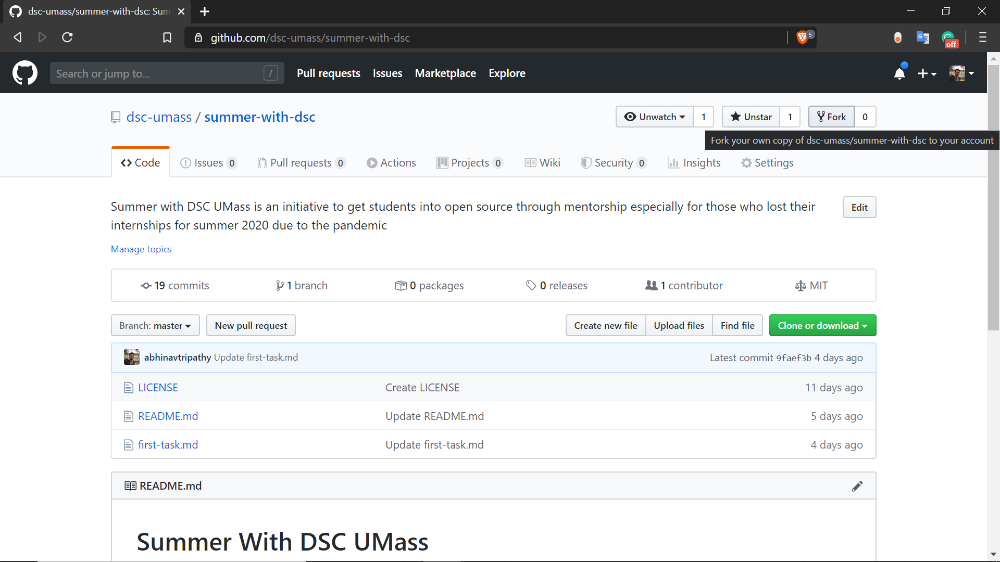
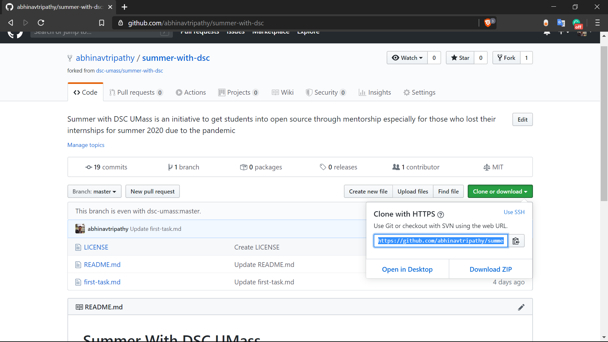
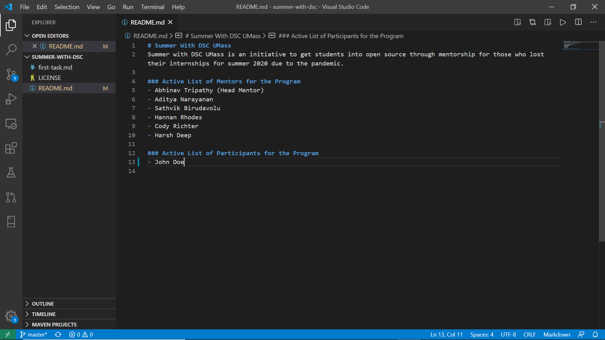
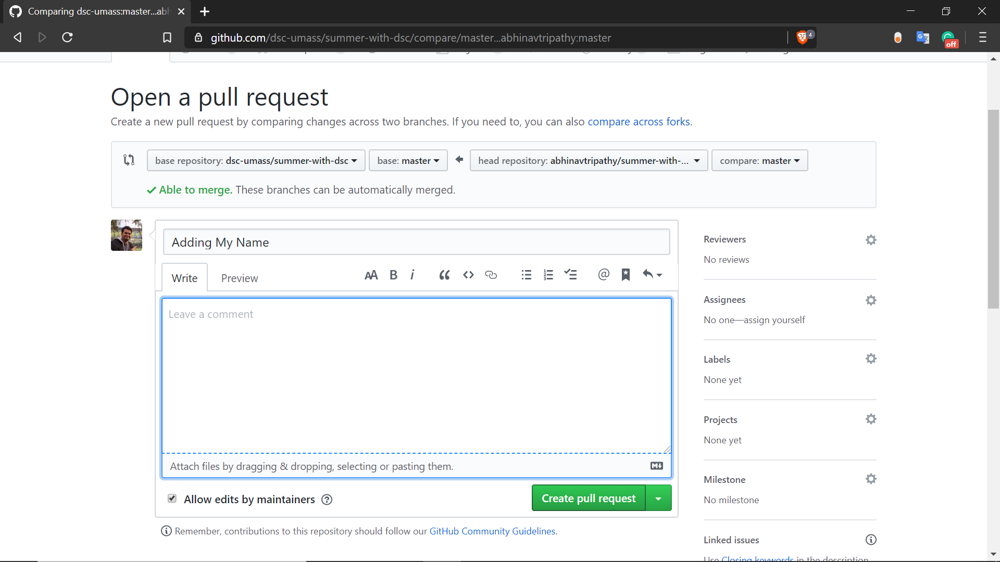

## First Task: Summer with DSC UMass

### Introduction 

Welcome to the Summer with DSC UMass program! We as a club love open source and we are trying to promote it and get students contributing to it. We want participants in this program to all understand how open source work in terms of [Git](https://git-scm.com/) and [Github](https://github.com/). Hence, we designed this first task to get everyone to understand how things work. 

### Goal

The Goal of the Task is to add your name under the "Active List of Participants for the Program" in the [README.md](https://github.com/dsc-umass/summer-with-dsc) in this repository. 

### Instructions 

- Make sure you have a github account and a text editor on your computer
- Open a new tab and go to [https://github.com/dsc-umass/summer-with-dsc](https://github.com/dsc-umass/summer-with-dsc)
- Fork the repository to your github account [More about Forking a Repo](https://help.github.com/en/enterprise/2.13/user/articles/fork-a-repo))



- This is how the forked repository would look like


- Copy the clone link from the forked repository 



- Go to your text editor terminal or any other terminal. For MacOS/Linux search for "terminal". For Windows search for "powershell" on your computer

- Change directory to a folder of your choice and type:

```
git clone "clone link"
```

Here "clone link" is the link you copied from the previous step, paste the link and do not add any quotes. 

- Open the folder with a text editor - we highly recommend VS Code for ease of use. Open the README.md file. 



Add your name with a "-" infront of it. Here for example we added "John Doe"

- Go to your terminal and make sure you are in the directory of the folder you cloned and type:

```
git add .

git commit -m "Adding My name"

git push
```

This adds all the files that have bene change and then commits them to your forked repository and then pushes the changes from your local computer to the repository on github.

- Go to your forked repo on github and click on "new pull request"


- The following window shows all the changes you have made. The changes should show your name being added. Click on "create pull request"


- Finally, add any comments that you feel are necessary and click on "create pull request"



- After you have done all this, we will reach out to you with next steps in terms of what projects might interest you and start that discussion. If you have any questions reach out to [team@umassdsc.com](mailto:team@umassdsc.com) 